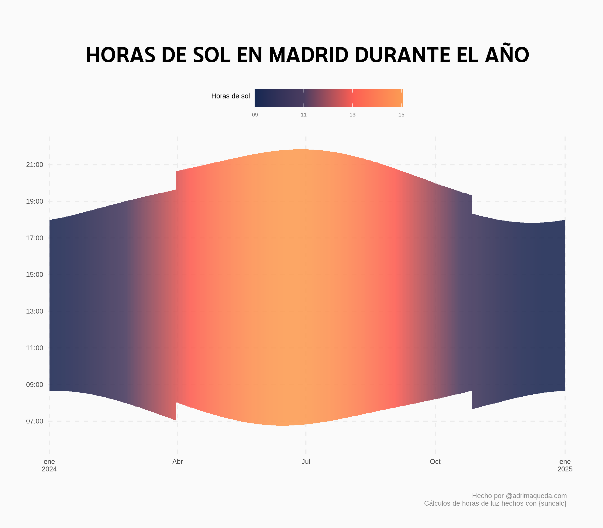

# BSKY BOT
> Desde el 4 de diciembre contenido ya no se genera desde automatizaciones de GitHub.
> A partir de esa fecha se ejecuta en local para poder generar texto con LLama3.2

🤖 Bot de Bluesky con R

🌅 Cada día a las 9am publica las horas de sol que habrá en Madrid para saber cómo de cerca estamos de la felicidad (días más largos)

📱 https://bsky.app/profile/horasdesolmadrid.bsky.social

Siéntete libre de proponer cualquier cambio que quieras 😊

Emojis descargados de [emojipedia](https://emojipedia.org/)

